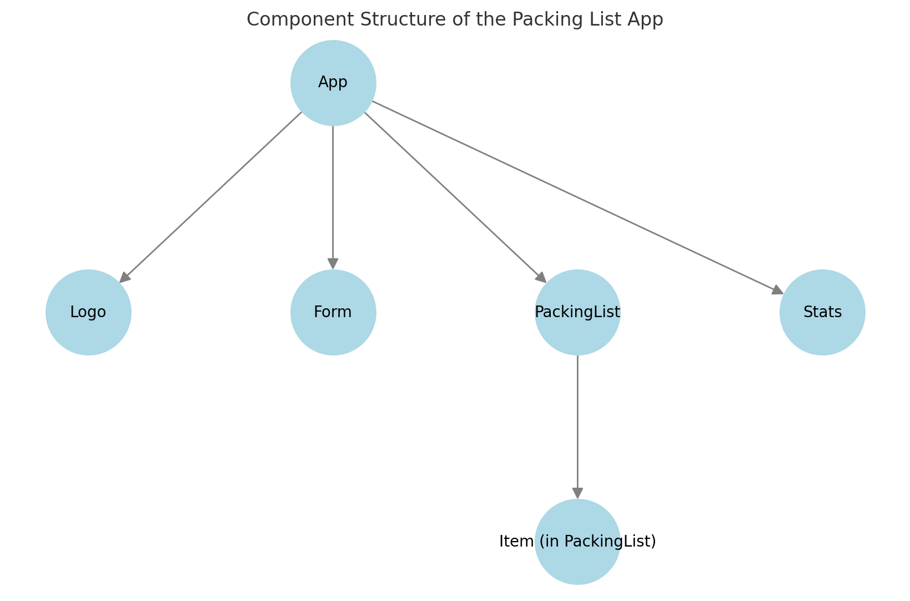

Here is a **visual mapping** of the component structure for your **Packing List App**.

### **Component Hierarchy**

1. **App (Parent Component)**
   - **Logo** → Displays the app logo.
   - **Form** → Handles adding new items.
   - **PackingList** → Displays the list of packed/unpacked items.
     - **Item (inside PackingList)** → Individual item components.
   - **Stats** → Displays packing statistics.

### **State Management Flow**

- **State (`items`) is managed in `App`** and passed down to `PackingList` and `Stats` via **props**.
- **Event Handlers (`handleAddItems`, `handleDeleteItem`, `handleToggleItem`) are defined in `App`** and passed to child components via props.
- **Props enable one-way data flow** from `App` → `Form`, `PackingList`, and `Stats`.

This hierarchical structure ensures **predictable re-renders** and maintains a **clear data flow**.

Let me know if you'd like any modifications or a more detailed breakdown! 🚀
